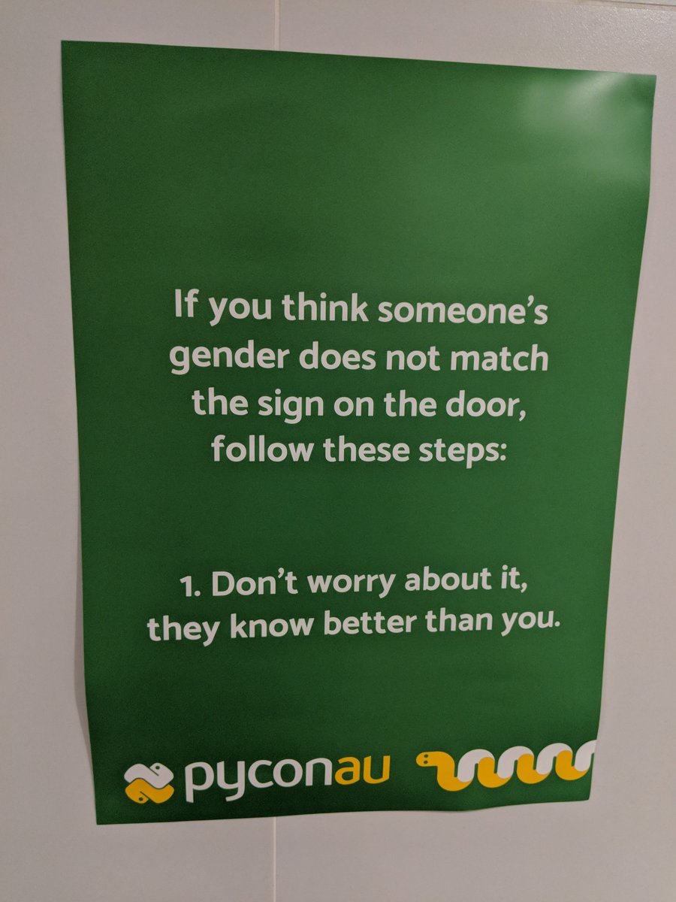
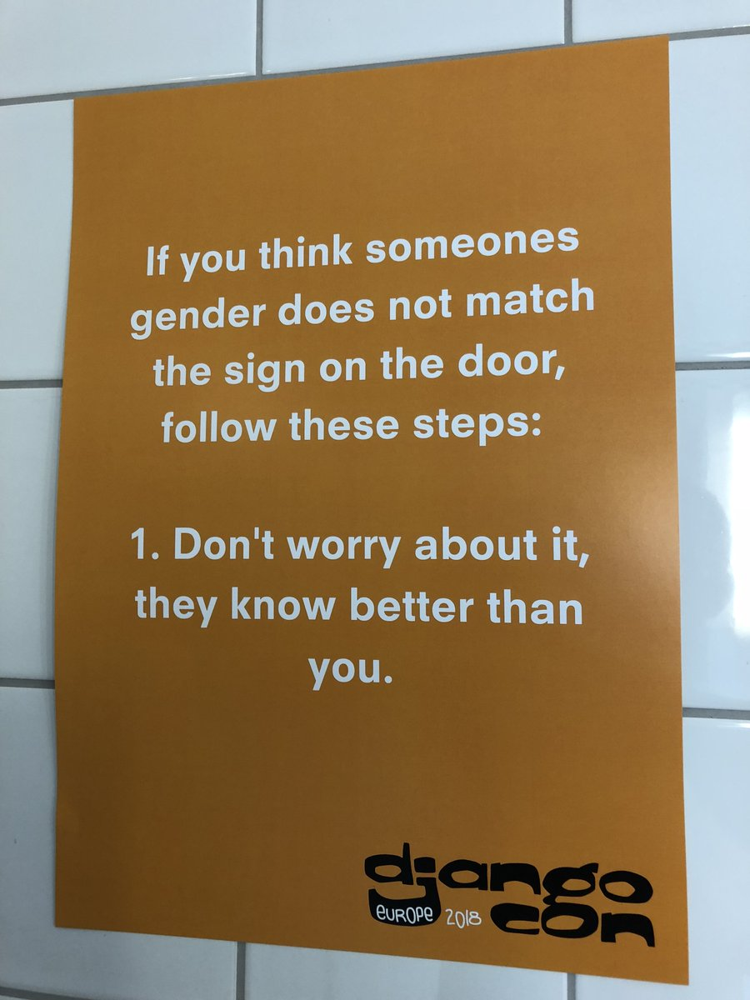
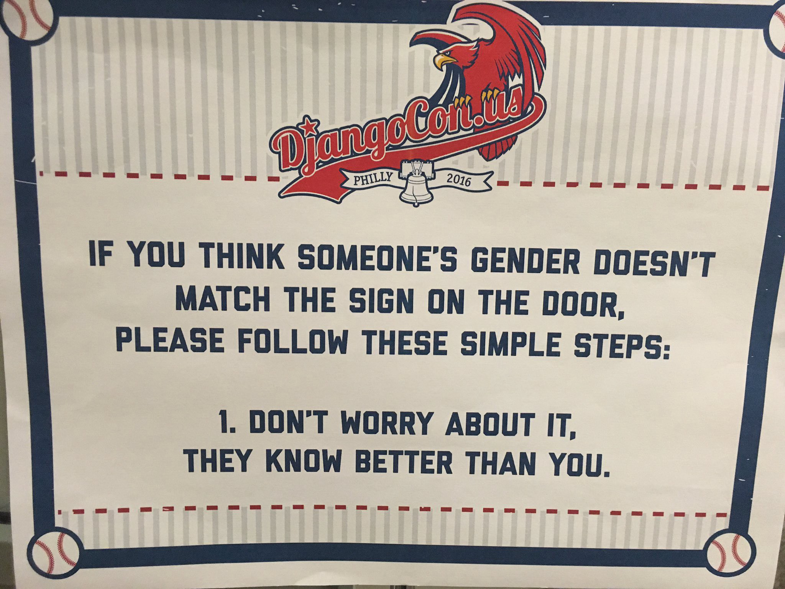
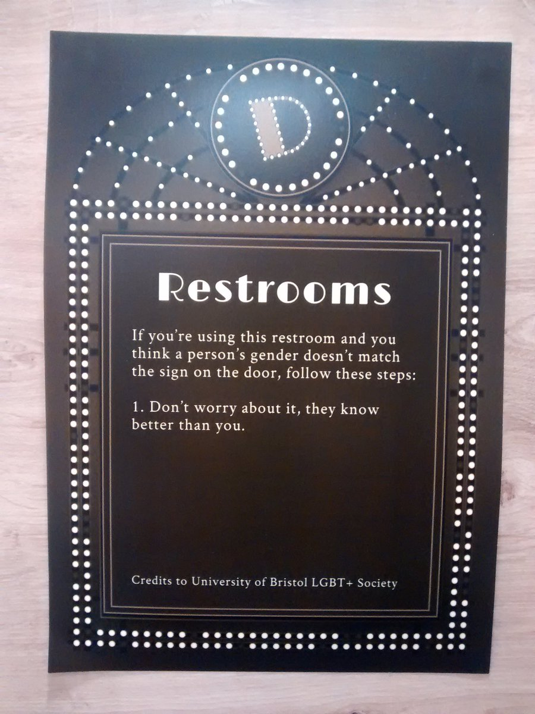

# On-site Signage and Customs

Communication is paramount with any event, especially when it comes to practical on-site logistics. 

Ensuring an attendee can find the venue is one thing (way-finding systems in conference centres are helpful here, but can end up being confusing); but having active and passive communication once attendees arrive ensures that everyone knows their rights and responsibilities. 

## Active

Opening announcements each day allow for active communication of our major communications. The first full-conference address starts with an [Acknowledgement of country](https://en.wikipedia.org/wiki/Welcome_to_Country#Acknowledgement_of_country), and a section dedicated to the overview of the event's Code of Conduct. Specifically, the contact details, and asking the members of the incident reporting team to stand so attendees can see the people they can contact. PyCon AU have also used a segmented lanyard system: white lanyards with sponsor logo for attendees, and green lanyards for organisers and active points of contact. Volunteers wore green bandanas, and could be contacted to help get in touch with a point of contact, or for other smaller questions. 

Other full-conference start-of-day addresses include a summarised version of the conduct details. 

We also took the time to describe social customs of our conference. Namely, the [PacMan](https://www.ericholscher.com/blog/2017/aug/2/pacman-rule-conferences/) rule, pronoun stickers, and our other passive signage. 

## Passive

In addition to our morning announcements, we have a series of passive signs around the venue to help communicate with attendees. 

We had Code of Conduct signage throughout the venue which listed the URL for the code of conduct, and contact methods (in our case, email and mobile). These were printed as full colour A3 matte posters, refreshing each year (as the mobile number and URL changed annually). We placed these posters everywhere they might be needed: in hallways, in the back of talk rooms, in bathrooms, and in other common areas. 

In addition, we had replacement bathroom signage. Our venue had "mens" and "womens" bathrooms. We covered these signs (with venue consent) to have bathroom signs showing what was in the room: stalls, or stalls and urinals. We complemented this with signage inside the rooms detailing our bathroom policy, which we lovingly stole from DjangoCon US and DjangoCon Europe: 

_If you think someone's gender doesn't match the sign on the door, follow these steps: 1. Don't worry about it. They know better than you._ 

Bathroom signage from PyCon AU 2018 ([source](https://twitter.com/liamosaur/status/1032792530893434880))

Bathroom signage from DjangoCon EU 2018 ([source](https://twitter.com/jmayer/status/999198253198594048))

Bathroom signage from DjangoCon US 2016 ([source](https://medium.com/@saronyitbarek/that-time-i-went-to-djangocon-and-fell-in-love-with-the-community-2cec0383c85b))

Bathroom signage from DjangoCon EU 2016 ([source](https://blog.sendecka.me/post/142478065688/djangocon-empathy-duty)

*Per the last image, this verbage was sourced from the University of Bristol's LGBT+ Society, so credit to them!*

Since we were already ordering a bunch of posters, we also got some of the "You look great!" poster we also saw used at DjangoCon US/Europe. Placed near the mirrors in the bathrooms, these were able to bring a touch of delight to our attendees. 

_Exclusive use of space_: Our ability to place signs in common conference areas was subject to us hiring an entire floor of our venue, and having exclusive use of the space. If your event is co-located in a conference centre, for example, this may not be possible. 

### Promotional

In addition, we have stage banners for sponsors. These are part of our obligation to our sponsors to get their logos noticed. Placed strategically behind speakers, both our conference logo and the higher-tier sponsor logo are visible on all video recordings. The sponsors for specific specialist tracks also get their logo behind speakers for their track. 

The lower tier sponsor logos are still visible, but these appear more often in attendee photos than they do in videos (as they are often hiding behind the lectern). 

These sponsor banners are good for one year, and we print five: one for each podium (two in the keynote room, one in each track room).

We also chose to commission conference banners that weren't branded with a year. Our hope is that we can re-use these year on year. The only downside of these is unless the year appears on the sponsor banner, it's not easy to tell at a glance which year a photo/recording is from. If you are going to have a banner that can only be used once, consider adding the year, or other defining feature. 

Keynote room rotating slides during breaks were able to be used for passive and promotional signage, and for the lowest sponsorship tier, this was the only logo promotion offered. 
